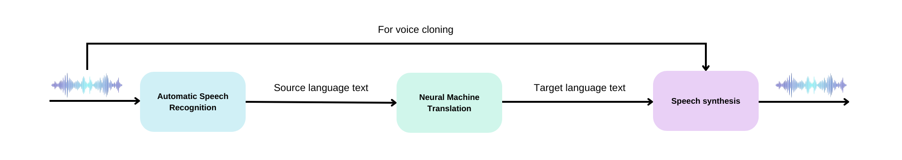

# Speech to Speech Machine Translation

In this project I work on Speech to Speech Machine translation that aims to translation an speech from a source language to a target language. In this project I perform the task between French and English. There are many approaches for doing so, here I adopt a cascaded approach that is the most simple. Hence I perform Speech to Text (Automatic Speech Recognition), then Machine Translation, then Text to Speech (Speech synthesis). Moreover I try to replicate the voice of the original speech in the target language.
Here is a depiction of the overall pipeline:



## Installation
Create the environment for the project:
```bash
conda env create -f environment.yaml
```
This will create an [Anaconda](https://anaconda.org) environment named `S2SMT` with all the dependencies installed. The you will just need to activate the environment:
```bash
conda activate S2SMT
```

Voilà ! You are ready to go !

## Usage

### Inference

```bash
python main --mode infer --audio your_audio --src_lang src_lang --trg_lang trg_lang
```

> 📝: `your_audio` must be replaced with the path to the sourc audio file. `src_lang` and `trg_lang` are either `fr` or `en`.
> The result will be save in a file named `out.wav`

### Sampling
In order to test the model on random samples of the Librispeech dataset or the French subset of the Multilingual Librispeech dataset, use the following command:

```bash
python --mode random_sampling --src_lang src_lang --trg_lang trg_lang --n_samples n_samples
```
> 📝: Be aware that this command will download the datasets and they are heavy. So make sure you have enough space on your disk.
> The outputs will be stored in folder named `output`

### Evaluation
For evaluating the model on the test sets of the datasets, one need to run the following command:

```bash
python --mode eval --src_lang src_lang --trg_lang trg_lang
```
> This will compute the BLEU score of the MT module, the WER score of the ASR module and the ASR-BLEU score of the overall model as defined by this [paper](https://arxiv.org/pdf/2107.05604).
>

### Examples

**French -> English**

[Input](./fr2en_input.wav) - [Output](./fr2en_target.wav)

**English -> French**

[Input](./en2fr_input.wav) - [Output](./en2fr_target.wav)


 

